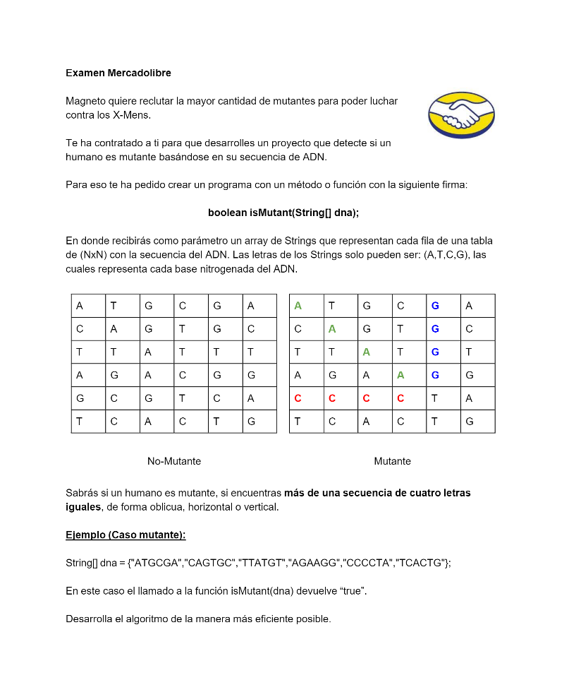

# Challenge: Logaritmo 

En este repositorio se encontrara unicamente el logaritmo que resuelve la parte logica, con sus respectivos tests, del changelle de Mercado Libre hecho en el lenguaje de programación [Go](https://go.dev/)  

# Instalación 

**Para poder probar el código asegúrate de:**

1. Tener instalado [Go](https://go.dev/) en tu máquina.
2. Clonar el repositorio en tu máquina: `git clone https://github.com/juanjgfredes/meli-challenge-logaritmo.git`.
3. Para probar el código sin compilar, escribe en la terminal: `go run main.go`.
4. Para compilar y probar, en la termina escribe `go build` y para ejecutar escribe `./meli-challenge-logaritmo`.

# Enunciado

